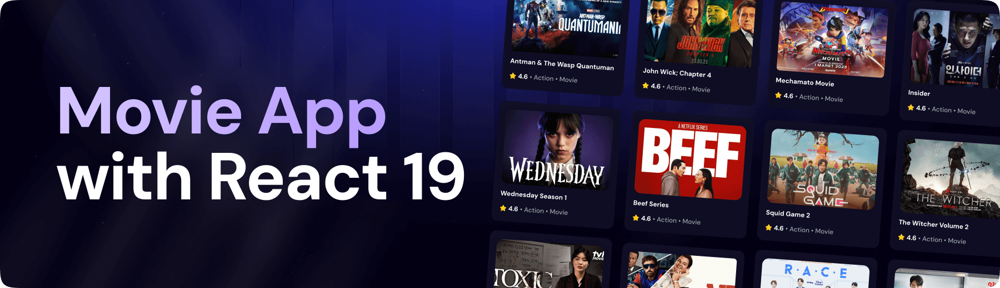

<div align="center">
  <br />
    <a href="https://www.youtube.com/watch?v=dCLhUialKPQ" target="_blank">
      
    </a>
  <br />
  
  <div>
    
    
    
  </div>

  <h3 align="center">A Movie Application</h3>

   <div align="center">
     Build this project step by step with our detailed tutorial on <a href="https://www.youtube.com/@javascriptmastery/videos" target="_blank"><b>JavaScript Mastery</b></a> YouTube. Join the JSM family!
    </div>
</div>

## 📋 <a name="table">Table of Contents</a>

1. 🤖 [Introduction](#introduction)
2. ⚙️ [Tech Stack](#tech-stack)
3. 🔋 [Features](#features)
4. 🤸 [Quick Start](#quick-start)
5. 🕸️ [Snippets (Code to Copy)](#snippets)
6. 🔗 [Assets](#links)
7. 🚀 [More](#more)

## 🚨 Tutorial

This repository contains the code corresponding to an in-depth tutorial available on our YouTube channel, <a href="https://www.youtube.com/@javascriptmastery/videos" target="_blank"><b>JavaScript Mastery</b></a>.

If you prefer visual learning, this is the perfect resource for you. Follow our tutorial to learn how to build projects like these step-by-step in a beginner-friendly manner!

<a href="https://www.youtube.com/watch?v=dCLhUialKPQ" target="_blank"></a>

## <a name="introduction">🤖 Introduction</a>

Built with React.js for the user interface, Appwrite for backend services, and styled with TailwindCSS, this Movie App lets users browse trending movies, search titles, and explore content using the TMDB API. It features a responsive layout and a sleek, modern design.

If you're getting started and need assistance or face any bugs, join our active Discord community with over **50k+** members. It's a place where people help each other out.

<a href="https://discord.com/invite/n6EdbFJ" target="_blank"></a>

## <a name="tech-stack">⚙️ Tech Stack</a>

- **[Appwrite](https://appwrite.io/)** is an open-source Backend-as-a-Service (BaaS) platform that provides developers with a set of APIs to manage authentication, databases, storage, and more, enabling rapid development of secure and scalable applications.

- **[React.js](https://react.dev/reference/react)** is a JavaScript library developed by Meta for building user interfaces. It allows developers to create reusable UI components that manage their own state, leading to more efficient and predictable code. React is widely used for developing single-page applications (SPAs) due to its virtual DOM that improves performance and ease of maintenance.

- **[React-use](https://github.com/streamich/react-use)** is a collection of essential React hooks that simplify common tasks like managing state, side effects, and lifecycle events, promoting cleaner and more maintainable code in React applications.

- **[Tailwind CSS](https://tailwindcss.com/)** is a utility-first CSS framework that provides low-level utility classes to build custom designs without writing custom CSS, enabling rapid and responsive UI development.

- **[Vite](https://vite.dev/)** is a modern build tool that provides a fast development environment for frontend projects. It offers features like hot module replacement (HMR) and optimized builds, enhancing the development experience and performance.


## <a name="features">🔋 Features</a>

👉 **Browse All Movies**: Explore a wide range of movies available on the platform.

👉 **Search Movies**: Easily search for specific movies using a search function.

👉 **Trending Movies Algorithm**: Displays trending movies based on a dynamic algorithm.

👉 **Modern UI/UX**: A sleek and user-friendly interface designed for a great experience.

👉 **Responsiveness**: Fully responsive design that works seamlessly across devices.

and many more, including code architecture and reusability
## movie_finder

A lightweight React app to search and browse movies using The Movie Database (TMDb) API.

## Features

- Search movies (debounced)
- Browse popular/discovered movies with pagination
- Movie details modal with trailer, cast, and "where to watch" providers
- Wishlist (localStorage)
- Trending section (Supabase-backed if configured, falls back to TMDb trending)

## Tech

- React + Vite
- TMDb API
- Optional: Supabase for storing trending searches

## Quick Start

1. Install dependencies

```bash
npm install
```

2. Add environment variables (copy `.env.example` or create a `.env`):

```
VITE_TMDB_API_KEY=YOUR_TMDB_BEARER_TOKEN
# Optional Supabase (for persisted trending)
VITE_SUPABASE_URL=https://your-project.supabase.co
VITE_SUPABASE_ANON_KEY=your-anon-key
```

- `VITE_TMDB_API_KEY` should be a TMDb v4 (Bearer) token or v3 key as used in the app.
- If Supabase is not configured, the app uses TMDb's trending endpoint as a fallback.

3. Run the dev server

```bash
npm run dev
```

Open http://localhost:5173 in your browser.

## Build

```bash
npm run build
npm run preview
```

## Notes

- Wishlist and user preferences are stored in `localStorage`.
- To enable server-backed trending, create a `trending_searches` table in Supabase with columns: `id`, `search_term`, `count`, `movie_id`, `poster_url`, `title`, `updated_at`.

## Contributing

1. Fork the repo
2. Create a branch: `git checkout -b feat/your-feature`
3. Commit your changes and open a PR

## License

MIT

